# Architecture Diagrams

## System Architecture

## Message Flow

## Queue Architecture

## Lock-Free Queue Implementation

## Performance Characteristics

```mermaid
graph TB
    subgraph "Performance Metrics"
        T[Throughput<br/>19M+ msg/sec]
        L[Latency<br/>< 5μs p99]
        Z[Zero Loss<br/>100% delivery]
        O[Ordering<br/>Guaranteed]
    end
    
    subgraph "Optimization Techniques"
        LF[Lock-Free Design]
        CA[Cache Alignment]
        BW[Busy Waiting]
        ZC[Zero Copy]
    end
    
    subgraph "Hardware Requirements"
        CPU[Multi-Core CPU]
        RAM[Sufficient RAM]
        CACHE[CPU Cache]
    end
    
    LF --> T
    CA --> L
    BW --> L
    ZC --> T
    
    CPU --> T
    RAM --> Z
    CACHE --> L
```

## Configuration Flow

## Error Handling

## Monitoring and Metrics

