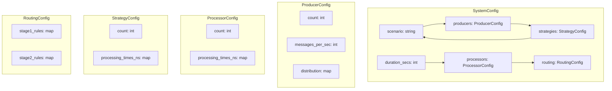
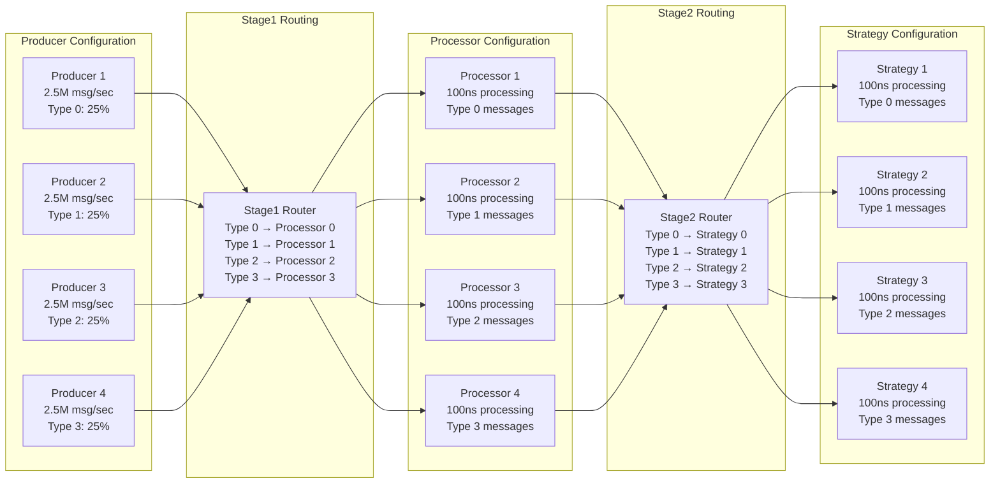
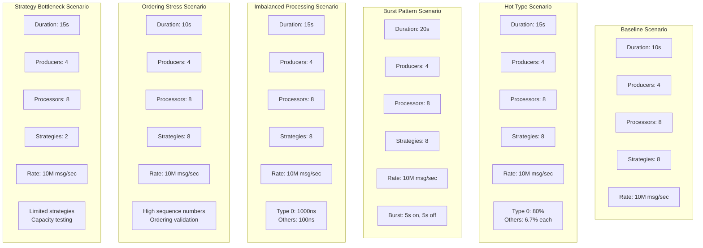
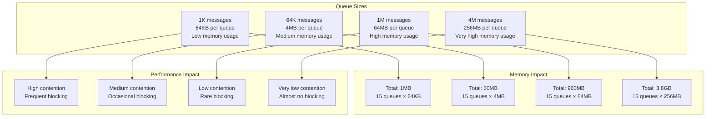
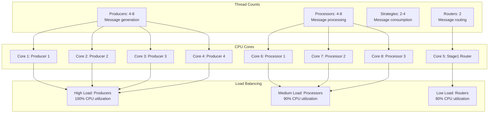
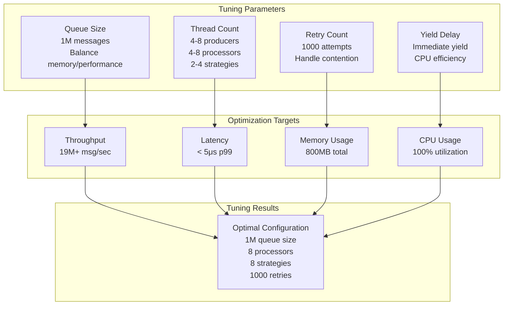

# Configuration Guide

## Configuration Structure

```mermaid
graph TB
    subgraph "SystemConfig"
        SCENARIO[scenario: string]
        DURATION[duration_secs: int]
        PRODUCERS[producers: ProducerConfig]
        PROCESSORS[processors: ProcessorConfig]
        STRATEGIES[strategies: StrategyConfig]
        ROUTING[routing: RoutingConfig]
    end
    
    subgraph "ProducerConfig"
        P_COUNT[count: int]
        P_RATE[messages_per_sec: int]
        P_DIST[distribution: map]
    end
    
    subgraph "ProcessorConfig"
        PR_COUNT[count: int]
        PR_TIMES[processing_times_ns: map]
    end
    
    subgraph "StrategyConfig"
        S_COUNT[count: int]
        S_TIMES[processing_times_ns: map]
    end
    
    subgraph "RoutingConfig"
        S1_RULES[stage1_rules: map]
        S2_RULES[stage2_rules: map]
    end
    
    SCENARIO --> PRODUCERS
    DURATION --> PROCESSORS
    PRODUCERS --> STRATEGIES
    PROCESSORS --> ROUTING
    STRATEGIES --> SCENARIO
```

## Message Flow Configuration

```mermaid
graph LR
    subgraph "Producer Configuration"
        P1[Producer 1<br/>2.5M msg/sec<br/>Type 0: 25%]
        P2[Producer 2<br/>2.5M msg/sec<br/>Type 1: 25%]
        P3[Producer 3<br/>2.5M msg/sec<br/>Type 2: 25%]
        P4[Producer 4<br/>2.5M msg/sec<br/>Type 3: 25%]
    end
    
    subgraph "Stage1 Routing"
        S1[Stage1 Router<br/>Type 0 → Processor 0<br/>Type 1 → Processor 1<br/>Type 2 → Processor 2<br/>Type 3 → Processor 3]
    end
    
    subgraph "Processor Configuration"
        PR1[Processor 1<br/>100ns processing<br/>Type 0 messages]
        PR2[Processor 2<br/>100ns processing<br/>Type 1 messages]
        PR3[Processor 3<br/>100ns processing<br/>Type 2 messages]
        PR4[Processor 4<br/>100ns processing<br/>Type 3 messages]
    end
    
    subgraph "Stage2 Routing"
        S2[Stage2 Router<br/>Type 0 → Strategy 0<br/>Type 1 → Strategy 1<br/>Type 2 → Strategy 2<br/>Type 3 → Strategy 3]
    end
    
    subgraph "Strategy Configuration"
        ST1[Strategy 1<br/>100ns processing<br/>Type 0 messages]
        ST2[Strategy 2<br/>100ns processing<br/>Type 1 messages]
        ST3[Strategy 3<br/>100ns processing<br/>Type 2 messages]
        ST4[Strategy 4<br/>100ns processing<br/>Type 3 messages]
    end
    
    P1 --> S1
    P2 --> S1
    P3 --> S1
    P4 --> S1
    
    S1 --> PR1
    S1 --> PR2
    S1 --> PR3
    S1 --> PR4
    
    PR1 --> S2
    PR2 --> S2
    PR3 --> S2
    PR4 --> S2
    
    S2 --> ST1
    S2 --> ST2
    S2 --> ST3
    S2 --> ST4
```

## Test Scenarios Configuration

```mermaid
graph TB
    subgraph "Baseline Scenario"
        B_DUR[Duration: 10s]
        B_PROD[Producers: 4]
        B_PROC[Processors: 8]
        B_STRAT[Strategies: 8]
        B_RATE[Rate: 10M msg/sec]
    end
    
    subgraph "Hot Type Scenario"
        H_DUR[Duration: 15s]
        H_PROD[Producers: 4]
        H_PROC[Processors: 8]
        H_STRAT[Strategies: 8]
        H_RATE[Rate: 10M msg/sec]
        H_DIST[Type 0: 80%<br/>Others: 6.7% each]
    end
    
    subgraph "Burst Pattern Scenario"
        BU_DUR[Duration: 20s]
        BU_PROD[Producers: 4]
        BU_PROC[Processors: 8]
        BU_STRAT[Strategies: 8]
        BU_RATE[Rate: 10M msg/sec]
        BU_PATTERN[Burst: 5s on, 5s off]
    end
    
    subgraph "Imbalanced Processing Scenario"
        I_DUR[Duration: 15s]
        I_PROD[Producers: 4]
        I_PROC[Processors: 8]
        I_STRAT[Strategies: 8]
        I_RATE[Rate: 10M msg/sec]
        I_TIMES[Type 0: 1000ns<br/>Others: 100ns]
    end
    
    subgraph "Ordering Stress Scenario"
        O_DUR[Duration: 10s]
        O_PROD[Producers: 4]
        O_PROC[Processors: 8]
        O_STRAT[Strategies: 8]
        O_RATE[Rate: 10M msg/sec]
        O_ORDER[High sequence numbers<br/>Ordering validation]
    end
    
    subgraph "Strategy Bottleneck Scenario"
        S_DUR[Duration: 15s]
        S_PROD[Producers: 4]
        S_PROC[Processors: 8]
        S_STRAT[Strategies: 2]
        S_RATE[Rate: 10M msg/sec]
        S_BOTTLENECK[Limited strategies<br/>Capacity testing]
    end
```

## Queue Configuration

```mermaid
graph TB
    subgraph "Queue Sizes"
        Q1K[1K messages<br/>64KB per queue<br/>Low memory usage]
        Q64K[64K messages<br/>4MB per queue<br/>Medium memory usage]
        Q1M[1M messages<br/>64MB per queue<br/>High memory usage]
        Q4M[4M messages<br/>256MB per queue<br/>Very high memory usage]
    end
    
    subgraph "Memory Impact"
        MEM1K[Total: 1MB<br/>15 queues × 64KB]
        MEM64K[Total: 60MB<br/>15 queues × 4MB]
        MEM1M[Total: 960MB<br/>15 queues × 64MB]
        MEM4M[Total: 3.8GB<br/>15 queues × 256MB]
    end
    
    subgraph "Performance Impact"
        PERF1K[High contention<br/>Frequent blocking]
        PERF64K[Medium contention<br/>Occasional blocking]
        PERF1M[Low contention<br/>Rare blocking]
        PERF4M[Very low contention<br/>Almost no blocking]
    end
    
    Q1K --> MEM1K
    Q64K --> MEM64K
    Q1M --> MEM1M
    Q4M --> MEM4M
    
    Q1K --> PERF1K
    Q64K --> PERF64K
    Q1M --> PERF1M
    Q4M --> PERF4M
```

## Threading Configuration

```mermaid
graph TB
    subgraph "Thread Counts"
        PROD_THREADS[Producers: 4-8<br/>Message generation]
        PROC_THREADS[Processors: 4-8<br/>Message processing]
        STRAT_THREADS[Strategies: 2-4<br/>Message consumption]
        ROUTER_THREADS[Routers: 2<br/>Message routing]
    end
    
    subgraph "CPU Cores"
        CORE1[Core 1: Producer 1]
        CORE2[Core 2: Producer 2]
        CORE3[Core 3: Producer 3]
        CORE4[Core 4: Producer 4]
        CORE5[Core 5: Stage1 Router]
        CORE6[Core 6: Processor 1]
        CORE7[Core 7: Processor 2]
        CORE8[Core 8: Processor 3]
    end
    
    subgraph "Load Balancing"
        HIGH_LOAD[High Load: Producers<br/>100% CPU utilization]
        MED_LOAD[Medium Load: Processors<br/>90% CPU utilization]
        LOW_LOAD[Low Load: Routers<br/>80% CPU utilization]
    end
    
    PROD_THREADS --> CORE1
    PROD_THREADS --> CORE2
    PROD_THREADS --> CORE3
    PROD_THREADS --> CORE4
    
    ROUTER_THREADS --> CORE5
    PROC_THREADS --> CORE6
    PROC_THREADS --> CORE7
    PROC_THREADS --> CORE8
    
    CORE1 --> HIGH_LOAD
    CORE2 --> HIGH_LOAD
    CORE3 --> HIGH_LOAD
    CORE4 --> HIGH_LOAD
    CORE5 --> LOW_LOAD
    CORE6 --> MED_LOAD
    CORE7 --> MED_LOAD
    CORE8 --> MED_LOAD
```

## Performance Tuning

```mermaid
graph TB
    subgraph "Tuning Parameters"
        QUEUE_SIZE[Queue Size<br/>1M messages<br/>Balance memory/performance]
        THREAD_COUNT[Thread Count<br/>4-8 producers<br/>4-8 processors<br/>2-4 strategies]
        RETRY_COUNT[Retry Count<br/>1000 attempts<br/>Handle contention]
        YIELD_DELAY[Yield Delay<br/>Immediate yield<br/>CPU efficiency]
    end
    
    subgraph "Optimization Targets"
        THROUGHPUT[Throughput<br/>19M+ msg/sec]
        LATENCY[Latency<br/>< 5μs p99]
        MEMORY[Memory Usage<br/>800MB total]
        CPU[CPU Usage<br/>100% utilization]
    end
    
    subgraph "Tuning Results"
        OPTIMAL[Optimal Configuration<br/>1M queue size<br/>8 processors<br/>8 strategies<br/>1000 retries]
    end
    
    QUEUE_SIZE --> THROUGHPUT
    THREAD_COUNT --> LATENCY
    RETRY_COUNT --> MEMORY
    YIELD_DELAY --> CPU
    
    THROUGHPUT --> OPTIMAL
    LATENCY --> OPTIMAL
    MEMORY --> OPTIMAL
    CPU --> OPTIMAL
```
