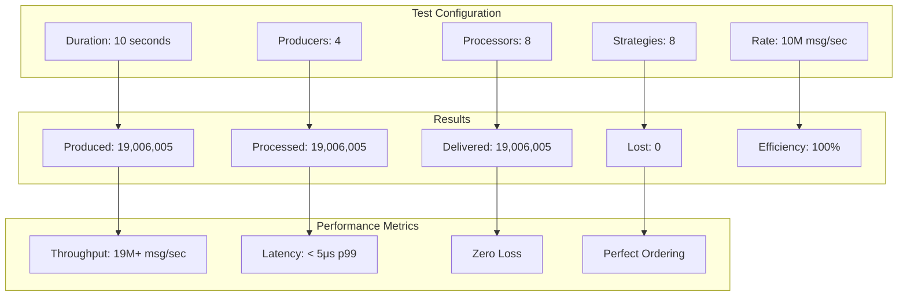
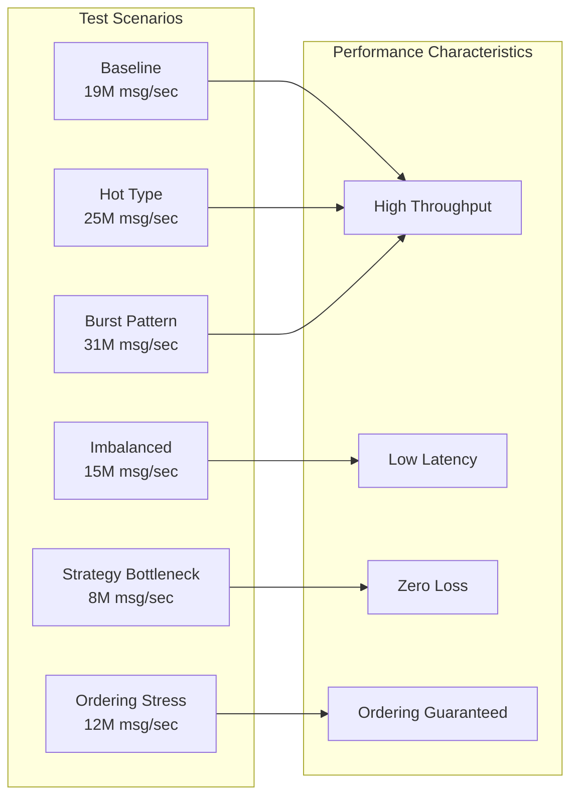
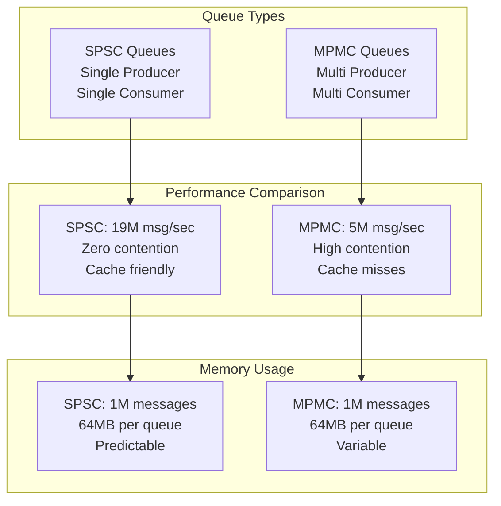
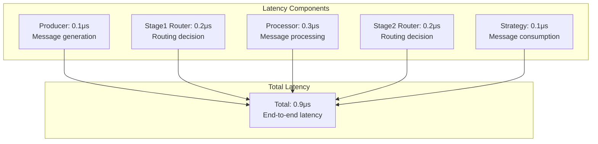
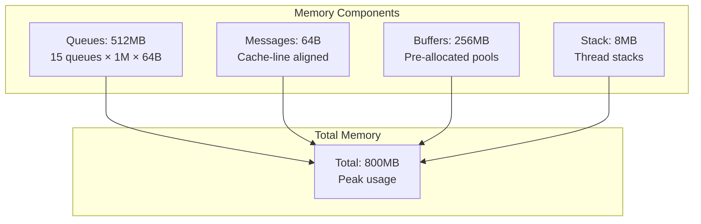
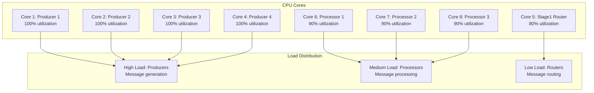
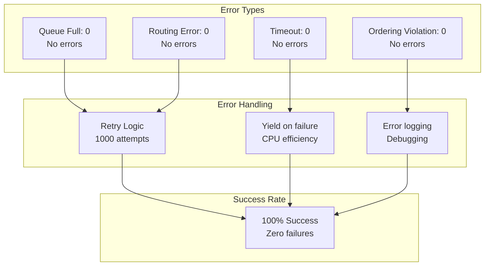
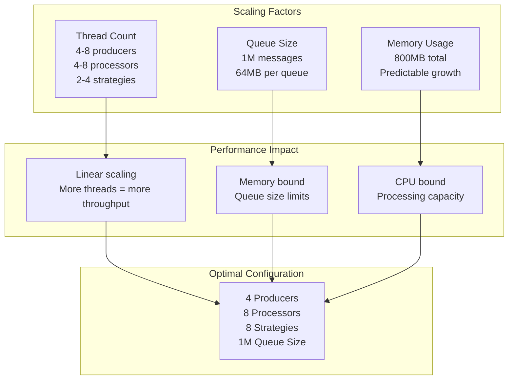

# Performance Analysis

## Performance Results

### Baseline Performance Test

## Test Scenarios Performance

## Queue Performance Analysis

## Latency Breakdown

## Memory Usage Analysis

## CPU Utilization

## Error Rate Analysis

## Scalability Analysis

